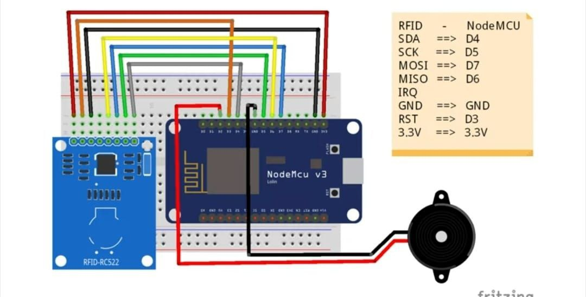
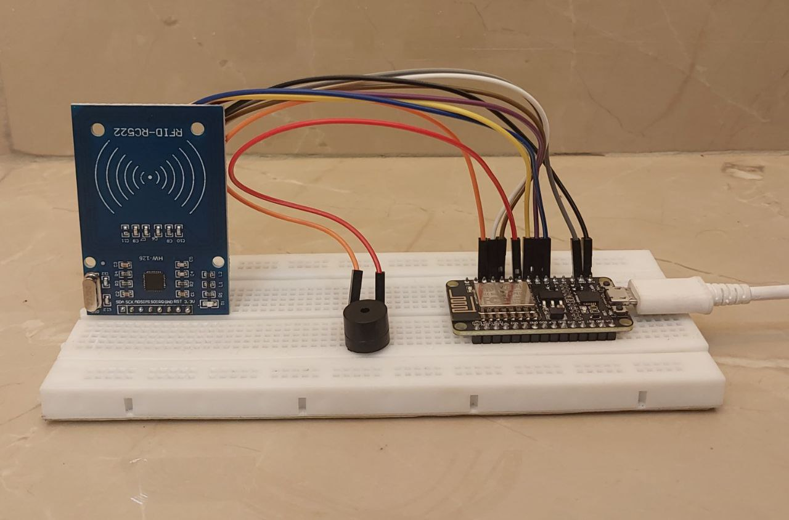
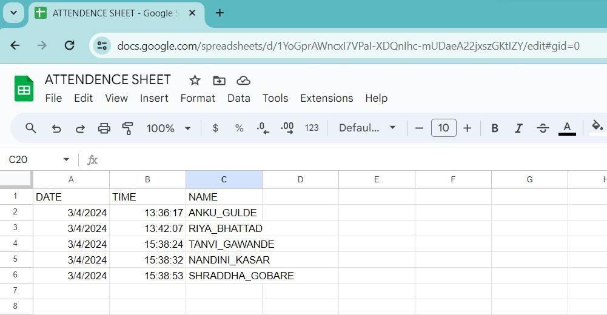

#📌IoT-Based Attendance System using NodeMCU, RFID & Google Sheets

📖***Overview***
This project is a real-time, IoT-based attendance system developed using RFID, NodeMCU (ESP8266), and Google Sheets API. It automates the process of attendance tracking by logging data directly to a cloud-based Google Sheet, eliminating the need for manual entries. The system ensures contactless, fast, and accurate attendance recording, ideal for schools, colleges, or workplaces.
###💡Features

📶 Real-Time Data Logging to Google Sheets
🪪 RFID-Based Identification for secure attendance marking
☁️ Cloud Storage using Google Sheets API
⚡ Contactless & Quick attendance marking
📊 Easy access to attendance history/logs
🔌 Powered by NodeMCU (ESP8266 Wi-Fi Module)

###🛠️Tech Stack

**Hardware:**
NodeMCU ESP8266
RFID Reader (RC522)
RFID Tags/Cards
Jumper Wires & Breadboard

**Software:**
Arduino IDE
Google Apps Script (for Google Sheets integration)
Google Sheets API

###🔧How It Works
When an RFID tag is scanned, the NodeMCU reads the unique ID.
The NodeMCU connects to Wi-Fi and sends the data to a Google Apps Script web app URL.
The script processes the request and logs the data (ID, timestamp, etc.) into a Google Sheet.
The sheet serves as a centralized attendance database accessible from anywhere.

###⚙️Setup Instructions
**1. Hardware Setup**
  
Connect the RFID reader to NodeMCU:

SDA → D2
SCK → D5
MOSI → D7
MISO → D6
IRQ → Not Connected
GND → GND
RST → D1
3.3V → 3.3V

**2. Software Setup**
A. Arduino Code
Install the following libraries:
ESP8266WiFi
MFRC522
SPI

Edit the code to add:

Wi-Fi SSID & Password
Your Google Apps Script Web App URL

**B. Google Sheets Integration**
Create a new Google Sheet.
Open the Script Editor (Extensions > Apps Script) and paste the script to accept and log HTTP POST requests.
Deploy it as a Web App with:
Execution: Me
Access: Anyone (or your preferred setting)
Copy the Web App URL and paste it into your Arduino code.

###🚀 Future Enhancements
Add Name Lookup & Display on LCD
Auto Email Summary of Attendance Logs
Admin Dashboard with Analytics
OTP or Face Recognition Integration

###📸 Demo

###🙌Acknowledgements
Google for Apps Script & Sheets API
Open-source libraries for RFID & ESP8266
Inspiration from IoT-based automation projects

###📃License
This project is open-source under the MIT License.

### 🧑‍🤝‍🧑 Project Partner
This project was developed by **[Shraddha Gobare](https://www.linkedin.com/in/shraddha-gobare)** in collaboration with **[Ms.Riya Bhattad](https://www.linkedin.com/in/riya-bhattad)**.

### 🚀 Scope for Future Enhancement & Collaboration
We’re open to collaborations for expanding this project further.  
Feel free to connect with us on [LinkedIn](https://www.linkedin.com/in/shraddha-gobare)  and [LinkedIn](https://www.linkedin.com/in/riya-bhattad) or contribute via GitHub!

